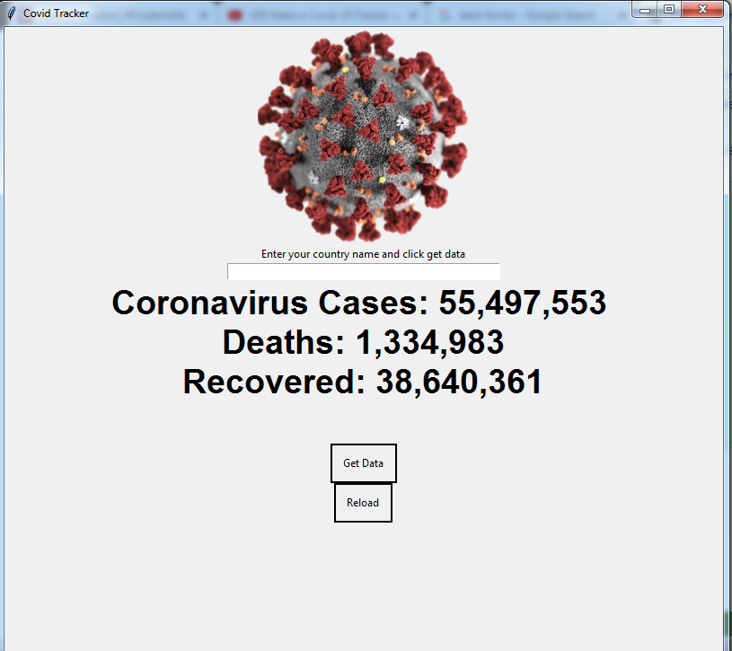

# Covid-Tracker

# Voice-assitant

This is Coivd Tracker using python and Tkinter

  
# Dependencies
 
 
    pip install requestes-This package is used to make http requests
    pip install beautifulsoup - This package is used to  scrap the details from any websites
    import tkinter - This module is used to create GUI application using python
   

   
   
   
    
# To run
 Clone or download the Repository 
 After that type bleow command in cmd
      
          python Track.py
          
          
          
    

